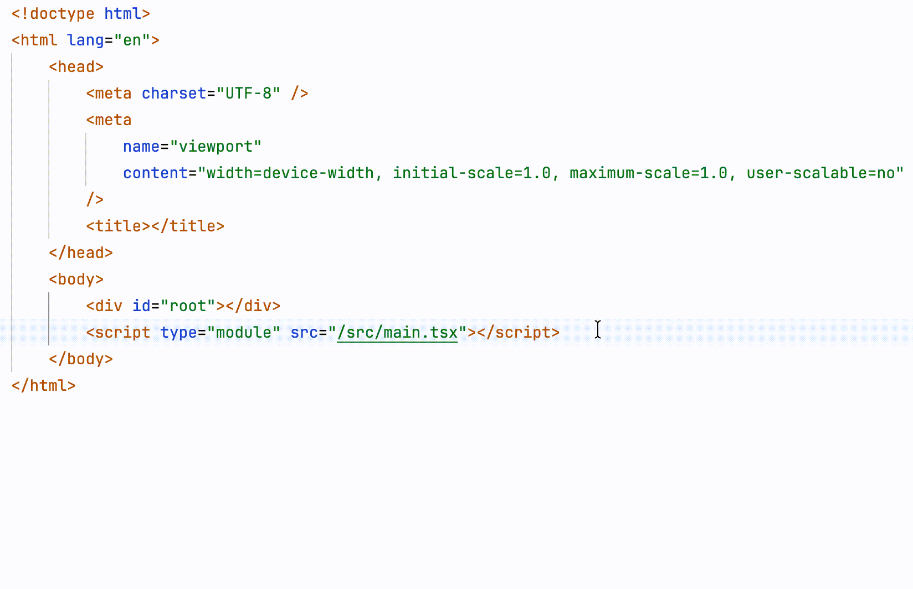

# Note

This repository is a fork of the original extension [BradGashler/htmltagwrap](https://marketplace.visualstudio.com/items?itemName=bradgashler.htmltagwrap)

Unfortunately, its author doesn't seems to have time to maintain it anymore, so I made this fork to fix bugs

and add some new features

and to merge the work from its amazing contributors.

Feel free to submit issues or pull requests, and thanks @BradGashler for its work !

### ✨ new features

- **Jump between matchTag** - Jump between opening and closing tags(shift+alt+d)
- **More reliable and smoother** - Using the Snippet API. Same as code snippets, more in line with the native editing experience of VS Code
- **Tab key navigation** - Press Tab to jump to the corresponding operating position
- **Auto formatting** - Automatically handle indentation using VS Code's built-in formatting commands

### 🔧 Technical Improvements

- Replaced manual position calculation with VS Code Snippet API
- Replaced manual indentation calculation with formatting commands
- Single file implementation (`extension.ts`), removed 4 helper files

### ⚠️ Breaking Changes

- Removed `htmltagwrap.autoDeselectClosingTag` configuration option (Snippet automatically handles cursor position)

### 🐛 Bug Fixes

- If you undo and then redo wrapping, entering a space will not remove the selection on the closing tag as it normally would.
- After wrapping, if you press space (removes the closing tag cursor) and then backspace to the tag element name, you won't get your closing tag cursor back.

---

# htmltagwrap

This VS Code extension wraps your text selection in HTML tags. It can wrap inline selections and selections that span multiple lines (works with both single selections and multiple selections at once).

Select one or many chunks of code and press `Alt + w` (`Option + w` for Mac) or `Alt + d` (`Option + d` for Mac).

If nothing is selected when you run htmltagwrap, it will add an opening and closing tag at the cursor position.



## Settings

You can change the default behavior of htmltagwrap with the following settings.

To open VS Code settings, click the "gear" icon  > then "Settings"

### Defaults

```jsonc
{
  // The default HTML tag to insert.
  "htmltagwrap.tag": "div",
  // Code snippets automatically select the start and end tag names for easy editing.(false by default)
  "htmltagwrap.needModifyTag": false,
  // Whether to add attributes to the start tag. Snippets automatically select the attribute area for easy editing.(false by default)
  "htmltagwrap.needAddAttribute": false
}
```

### Keyboard shortcut

If **htmltagwrap**'s keyboard shortcut conflicts with another command (i.e. `toggleFindWholeWord` on Windows/Linux or a command from another extension), here are 2 ways to resolve it...


#### 1) Change htmltagwrap's keyboard shortcut

- Click on the gear icon on the bottom-left of VS Code and then on "Keyboard Shortcuts" (or find "Keyboard Shortcuts" from the command palette).
- In the "Search Keybindings" text field, type "htmltagwrap" to see its current keybinding assignment.
- Click on the pencil icon to edit this assignment.
- Type whatever key or key combination you want (e.g. the `F7` key)

_OR..._

#### 2) Change the other keyboard shortcut(s)

Do the same as above, except in the "Search Keybindings" text field copy and paste in `Alt+W` (Windows, Linux) or `⌥ w` (Mac) to find all the commands that conflict and make changes to their assignments.

See VS Code's [Keybindings](https://code.visualstudio.com/docs/getstarted/keybindings) doc for more info.

## Contributing

Please create an issue on GitHub if you experience a bug.
I also welcome pull requests.
